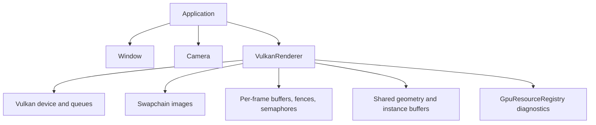

# Architecture

VolkEngine is currently a compact C++23 engine scaffold around a real Vulkan 1.3 renderer. The design bias is explicit ownership, measurable frame work, and a small public API until the engine has enough systems to justify broader abstraction.

## Subsystem map

| Path | Responsibility | Public surface |
| --- | --- | --- |
| `engine/core` | Application lifecycle, config, clock, camera, math, logging, file reads, assertions. | `EngineConfig`, `RunOptions`, `Application`, `Camera`, `Clock`, helper functions. |
| `engine/platform` | GLFW window, input, framebuffer resize state, Vulkan surface creation. | `Window`. |
| `engine/renderer` | Renderer contracts, scene submission data, generated geometry, image loading, frame graph metadata, resource accounting. | `IRenderer`, `RenderStats`, `RenderDeviceInfo`, `SceneRenderList`, `FrameGraph`, `GpuResourceRegistry`, mesh/image helpers. |
| `engine/renderer/vulkan` | Concrete Vulkan backend and Vulkan/VMA object lifetime. | Advanced integration only: `VulkanRenderer`. |
| `engine/shaders` | GLSL source compiled to SPIR-V by CMake. | Runtime shader files copied beside the sandbox. |
| `samples/sandbox` | Demo app, CLI flags, smoke scenarios. | Executable entry point, not engine API. |

## Ownership model

- `Application` owns `Window`, `Camera`, `VulkanRenderer`, and `Clock`.
- `Window` owns the GLFW handle and exposes only events, size, title, camera input, and surface creation.
- `VulkanRenderer` owns every Vulkan object it creates and tears them down in dependency order.
- Buffers/images use explicit structs containing Vulkan handles plus VMA allocations; VMA picks memory types and suballocates.
- Swapchain-owned image views, render targets, and per-image present semaphores are recreated with the swapchain.
- Per-frame uniform, instance, and indirect buffers are frame-slot resources; the renderer grows instance storage only after that frame's fence signals.

## Runtime data flow

1. `Clock::tick()` returns elapsed and delta time.
2. `Window::updateCamera()` applies keyboard/mouse input to `Camera`.
3. `Application::run()` calls `IRenderer::draw(camera, elapsedSeconds, frameDeltaMs)`.
4. The renderer updates scene uniforms from camera/light state.
5. `DemoSceneRenderer` provides a reusable `SceneRenderList` containing mesh IDs, transforms, material constants, and bounds.
6. `VulkanRenderer` builds a CPU-only visibility plan, batches visible work by mesh, writes mapped instance/indirect buffers, records Vulkan commands, submits, and presents.
7. `RenderStats` and `RenderDeviceInfo` expose what path was used and how the last submitted frame behaved.

## Public/private line

Public API is the engine-facing contract in these headers:

- `engine/core/Config.hpp`
- `engine/core/Application.hpp`
- `engine/core/Camera.hpp`
- small helpers in `engine/core/*`
- `engine/platform/Window.hpp`
- `engine/renderer/Renderer.hpp`
- `engine/renderer/SceneRenderer.hpp`
- `engine/renderer/FrameGraph.hpp`
- `engine/renderer/GpuResourceRegistry.hpp`
- `engine/renderer/Geometry.hpp`
- `engine/renderer/ImageLoader.hpp`

`engine/renderer/vulkan/VulkanRenderer.hpp` is backend-specific. Use it directly only when wiring a Vulkan backend into an app; do not model game-facing systems around its private Vulkan details.

## Current architectural constraints

- One renderer backend exists: Vulkan.
- The renderer interface is intentionally small: `draw`, `stats`, and `deviceInfo`.
- The frame graph is metadata/validation, not yet a transient-resource allocator or barrier owner.
- Scene submission is data-oriented and demo-focused; it is not a general ECS or streaming scene system yet.
- Descriptor indexing support is reported as capability metadata, but bindless descriptors are not enabled until the resource model needs them.
