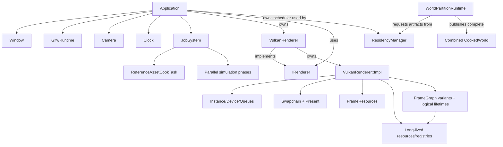

# Architecture

VolkEngine is currently a compact C++23 engine scaffold around a real Vulkan 1.3 renderer. The design bias is explicit ownership, measurable frame work, and a small public API until the engine has enough systems to justify broader abstraction.

## Subsystem map

| Path | Responsibility | Public surface |
| --- | --- | --- |
| `engine/core` | Application lifecycle, bounded job scheduling, deterministic serial/parallel simulation phases, config, clock, camera, world/entity-component storage, math, logging, file reads, assertions. | `EngineConfig`, `RunOptions`, `Application`, `JobSystem`, `WorldSystemScheduler`, `World`, `Camera`, `Clock`, helper functions. |
| `engine/platform` | GLFW process runtime, window, input, framebuffer resize state, Vulkan surface creation. | `GlfwRuntime`, `Window`. |
| `engine/scene` | Runtime reflection metadata, stable scene component payloads, legacy world snapshots, and optimized cooked-world loading/instantiation. | `SceneTypeRegistry`, generated/explicit/external schemas, `CookedWorld`, runtime instantiation. |
| `engine/renderer` | Renderer contracts, lighting/material ABI and bounded planning contracts, world-to-scene extraction, scene submission data, procedural/imported mesh helpers, image loading, executable frame graph, and resource accounting. | `IRenderer`, `RenderStats`, `RenderDeviceInfo`, `SceneRenderList`, lighting/environment records, `WorldSceneExtractor`, `FrameGraph`, `GpuResourceRegistry`, mesh/image helpers. |
| `engine/landscape` | Deterministic bounded landscape queries and cook-time terrain, water, foliage scatter, and reusable vegetation geometry. | `LandscapeField`, `TerrainPatch`, `FoliageInstance`, generation functions. |
| `engine/renderer/vulkan/VulkanRenderer.hpp` | Backend façade used by app code: constructor/lifecycle, renderer entry points, and transactional authored-asset publication. | `VulkanRenderer`, `draw`, `reloadReferenceAssets`, `meshBounds`, `stats`, `deviceInfo`, `requestScreenshot`, `waitIdle`; deleted copy/move. |
| `engine/renderer/vulkan/VulkanRendererImpl.hpp` | Private `Impl` declaration for backend state, method contracts, and lightweight shared helpers; source-local heavy helpers stay in their owning `.cpp` files. | Internal only (not part of engine API). |
| `engine/renderer/vulkan` | Cohesive split implementation units for backend internals. | `VulkanRenderer.cpp` (thin forwarding wrapper), plus module-specific `.cpp` files. |
| `engine/renderer/vulkan/VulkanRenderer.cpp` | Thin forwarding wrapper over `VulkanRenderer::Impl`. | Delegates each public call to private implementation. |
| `engine/shaders` | GLSL source compiled to SPIR-V by CMake. | Runtime shader files copied beside the sandbox. |
| `engine/editor` | Editor-only authoring document, command history, glTF conversion, cooker, session interactions, and optional ImGui shell. | `AuthoringDocument`, `EditorSession`, `AuthoringCooker`; excluded when `VOLKENGINE_ENABLE_EDITOR=OFF`. |
| `samples/sandbox` | Demo app, CLI flags, smoke scenarios. | Executable entry point, not engine API. |
| `samples/editor` | Interim creator executable and runtime publication wiring. | `VolkEngineEditor`, built only when editor and ImGui options are both enabled. |
| `samples/partition` | M1/M2 streamed-world and natural-landscape traversal gate, profiler, and schema-v7 evidence. | Executable integration benchmark, not engine API. |

## Ownership model

- `Application` member order keeps the renderer alive through frame execution, destroys it before the window/GLFW runtime, joins any pending asset cook before destroying the `JobSystem`, and keeps the active asset bundle alive through renderer teardown.
- `Application` constructs its bounded `JobSystem` before platform and renderer state, owns the stable active `ReferenceAssetBundle`, polls background `ReferenceAssetCookTask` completion, and publishes successful candidates only at a main-thread frame boundary. Renderer publication builds replacement mesh/cluster/texture resources and descriptor bindings before retiring the old set; any cook, upload, or publication failure keeps the previous bundle live.
- `JobSystem` preallocates job slots, dependency edges, worker deques, and timeline storage. Workers own their queues but may steal FIFO work; callbacks/contexts remain caller-owned until explicit terminal-handle release. Cooperative worker waits execute other ready jobs, preserving progress for nested one-worker workloads.
- `ResidencyManager` borrows the application-owned `JobSystem`, owns immutable
  resource descriptions, generational request state, resident byte payloads,
  and every submitted IO task/handle until terminal release. Its frame request
  set is the sole pinning boundary; worker callbacks own no manager state.
- `WorldPartitionRuntime` owns canonical cell hierarchy/index scratch, the
  active pinned leaf frontier, one pending complete-world candidate, and a
  rejected frontier. It borrows `ResidencyManager`; callers own publication into
  the live `World`. Candidate build/rebase occurs in temporary `CookedWorld`
  storage and a revisioned commit changes partition ownership only after the
  application has instantiated the complete world.
- `LandscapeField` is caller-owned deterministic cook/query state. Generated
  terrain and foliage become ordinary imported mesh/material records before
  renderer construction, then ordinary stable IDs in cooked partition cells;
  neither the renderer nor partition runtime owns a parallel landscape scene.
- `World` owns generational entities and component pools. `WorldSystemScheduler` owns compiled deterministic execution phases, reusable parallel-job storage, and one deferred command buffer; system callbacks and contexts remain caller-owned. Explicit read-only callbacks may share a phase through `JobSystem`, while every mutable callback and dependency boundary remains serial. Caller-owned standalone `WorldCommandBuffer` instances stage structural changes during queries and replay detached FIFO batches only at explicit safe boundaries. World renderable components (`WorldSceneTransform`, `WorldSceneParent`, `WorldSceneRenderable`) remain simulation-owned; `WorldSceneExtractor` owns reusable render-list, local-pose history, and hierarchy-resolution storage. The generic ECS owns no child lists or hierarchy lifecycle hooks.
- Typed `SimulationEventChannel` instances are scheduler-owned setup resources with fixed inline payload storage. Systems observe the previous successful step and publish the next FIFO batch; callback/overflow rollback and partial-command-playback promotion keep event lifetime aligned with the scheduler's actual mutation boundary.
- Scheduler-owned `SimulationTimerQueue` resources add delayed and recurring typed payloads on integer successful-step ticks. Schedule/cancel mutations share the same rollback/promotion boundary as event channels, while monotonic handles and fixed storage avoid wall-time drift, stale-handle aliasing, and steady-state allocation.
- `ScenePersistence` is a stateless one-shot boundary over the explicit scene component subset. VESN v2 canonicalizes records by persistent 128-bit `WorldSceneIdentity`, stores hierarchy references by stable ID, validates bounded UTF-8 labels and complete parent graphs, and reconstructs into a temporary `World`; v1 file-local ordinals migrate deterministically on load. It does not expose or serialize generic type-erased component pools.
- `SceneTypeRegistry` is runtime-neutral metadata. Generated annotation output,
  explicit C++ registration, and the external schema prototype publish the same
  stable binding manifest. Payload hooks validate and migrate copied candidates;
  registry publication never depends on ImGui or Vulkan.
- Editor-only `AuthoringDocument` owns stable entities, opaque/known component
  payloads, selection, dirty state, and bounded command history.
  `AuthoringCooker` converts that source model into deterministic `CookedWorld`
  arrays. Runtime instantiation resolves active asset handles into a temporary
  `World` and swaps only after complete success. Runtime builds retain the
  reflection/cooked-world reader while CMake omits all `engine/editor` sources.
- `GlfwRuntime` owns GLFW process initialization/termination. `Window` borrows the runtime and owns only its native window handle; one runtime is allowed per process and GLFW calls remain on the main thread.
- `InputTracker` converts platform callbacks and bounded gamepad polling into GLFW-free value snapshots. Caller-owned fixed-capacity `InputActionMap` instances translate those physical snapshots into semantic gameplay actions at fixed-step boundaries without allocating or mutating global input policy.
- `VulkanRenderer` owns runtime Vulkan behavior via private `Impl`, but keeps ownership boundaries explicit:
  - `VulkanRenderer.hpp` remains the backend API entry boundary.
  - `VulkanRenderer.cpp` remains a minimal forwarding wrapper.
  - Internal Vulkan resources (`VkInstance`, device/queues, descriptor state, swapchain state, uploads, etc.) stay private.
- Buffers/images use explicit structs containing Vulkan handles plus VMA allocations; VMA picks memory types and suballocates. The frame graph owns logical transient lifetimes, slots, and activation/retirement order while the Vulkan backend realizes the physical bindings transactionally.
- Swapchain-owned image views, graph-owned depth/HDR targets, and per-image present semaphores are recreated at one swapchain ownership boundary. The fixed shadow atlas and generated HDR environment are renderer-owned long-lived images. Imported swapchain/readback/environment resources never enter graph lifecycle callbacks.
- Per-frame uniform, instance, local-light, Forward+ tile-header/index, shadow-view, and optional indirect buffers are frame-slot resources; the renderer grows bounded scene/light-list storage only after that frame's fence signals.

## Renderer split summary

The authoritative Vulkan file-role map lives in [Renderer pipeline](renderer-pipeline.md#source-map--ownership-current-source-split). Architecture depends on these boundaries:

- `VulkanRenderer.hpp` is the backend-facing public seam.
- `VulkanRenderer.cpp` forwards that seam to `VulkanRenderer::Impl`.
- `VulkanRendererImpl.hpp` owns private state declarations, helper structs, constants, and method declarations.
- Split `.cpp` units group lifecycle/device/swapchain/frame resources, long-lived textures/environment/shadow resources, meshes, pipelines, uploads, sync, visibility planning, Forward+/shadow preparation, frame orchestration, optional ImGui, and screenshot behavior behind the same private `Impl`. Backend-neutral light validation, reference tile assignment, and deterministic atlas assignment remain in `engine/renderer/Lighting.cpp`.
- `VmaUsage.cpp` remains the single translation unit defining VMA implementation usage.

## Runtime data flow

1. `Clock::tick()` samples wall elapsed/delta time; `Window::pollInput()` consumes one event-driven frame snapshot.
2. `Window::updateCamera()` applies that snapshot at render rate with a bounded wall delta.
3. An optional frame-update callback maps the global observer to a partition
   frontier, advances `ResidencyManager` using the application `JobSystem`, and
   instantiates the prepared combined `CookedWorld` into the live runtime
   `World` through `Application`'s transactional resolver. Only after that
   succeeds does it commit the matching cell revision, evict superseded cells,
   and reset extraction history. An incomplete or failed candidate leaves the
   old world/frontier pinned and renderable.
   The M2 benchmark uses this seam to sample camera height, publish generated
   terrain/foliage/water cells, and collect visible-class and timing evidence.
4. `FixedStepClock` converts wall time into zero or more constant gameplay substeps with bounded retained debt. For scheduler-backed worlds, `WorldSceneExtractor` prepares TRS history, compiled systems execute single-threaded in dependency order, the scheduler plays structural commands once, and the extractor captures the successful state. Pending input edges/motion reach only the first emitted step while held state persists; failures discard scheduler commands, invalidate presentation history, and propagate.
5. The world run path builds a presentation snapshot with retained-debt alpha. It interpolates each entity's local translation/scale and shortest-path quaternion rotation one completed fixed step behind simulation, then iteratively resolves parent matrices before submission. New/recycled/teleported entities reset their local history; dead or stale parents detach and cyclic dependents are omitted. Both run paths then call `IRenderer::draw(camera, scene, sceneBuildMs, elapsedSeconds, frameDeltaMs)` immediately; the renderer borrows the reusable list synchronously.
6. `Visibility.cpp` computes visibility and work planning for LOD/grid batching. CPU visibility increments material-class histograms only for accepted items and cached tiles; GPU visibility writes post-frustum per-class counters into the completed frame record. `Lighting.cpp` validates the scene's directional/environment/local/probe records; the Vulkan lighting owner prepares bounded tile/atlas buffers and shadow cameras, then frame code fills mapped instance records.
7. `Frame.cpp` executes the selected compiled graph. Graph callbacks emit synchronization barriers and record Forward+ assignment, visibility cull, shadow atlas, optional depth, HDR PBR/environment shading, depth-pyramid, tonemap/ImGui, and optional screenshot work; one graphics submission/presentation remains the outer frame ownership boundary.
8. `RenderStats`, `RenderDeviceInfo`, bounded job counters, residency/partition
   metrics, visible landscape-class counts, and schema-v7 traversal/landscape
   records expose the actual renderer, streaming, and benchmark paths.

Scene files are loaded before entering `Application::run` and saved after it returns. Persistence therefore performs no frame-loop work and never competes with scheduler queries, deferred structural playback, extraction, or renderer borrowing.

The interim editor adds a separate creator path: glTF import → reflected
`AuthoringDocument` → transactional edits/undo → atomic authoring save →
deterministic `CookedWorld` cook → runtime asset resolution → temporary-world
publication. Its ImGui hierarchy, inspector, viewport picking/gizmos, and
profiling panels call only editor/session and renderer-overlay contracts; ImGui
state never enters either serialized format.

## Public/private line

Engine contracts (`IRenderer`, `FrameGraph`, `RenderStats`, config data) live in engine headers.  
`engine/renderer/vulkan/VulkanRenderer.hpp` remains the only backend entrypoint for app wiring.  
Its private `Impl` keeps Vulkan internals isolated from application code, which allows:
- no Vulkan handle leakage beyond the renderer boundary,
- stable renderer construction/call shape during backend refactors,
- optional features (`ImGui`, screenshot behavior, pipeline hot reload, transactional asset reload) without Vulkan handle leakage.

## Current architectural constraints

- One renderer backend exists: Vulkan.
- The renderer interface is intentionally small: `draw`, `stats`, and `deviceInfo` (plus explicit screenshot/idle hooks).
- The frame graph executes passes and owns backend-neutral barrier, lifetime, and transient-slot contracts. Vulkan resource realization and command emission remain private backend responsibilities.
- World partition provides deterministic CPU-side asynchronous artifact
  residency, hierarchical frontier selection, combined-world publication, and
  origin rebasing. Publication currently rebuilds/extracts the complete active
  frontier; it is not yet a GPU-page streaming scene representation.
- Landscape patches are deterministically CPU-cooked into hierarchy-selected
  local-space LOD meshes and queried through the same field used for placement;
  GPU visibility/submission and foliage deformation are runtime work. This is
  not a terrain-specific GPU page/virtual-texture architecture.
- Descriptor indexing enables a capability-gated bindless sampled-image table with stable texture indices; the Vulkan baseline retains a fixed descriptor fallback for unsupported devices.
