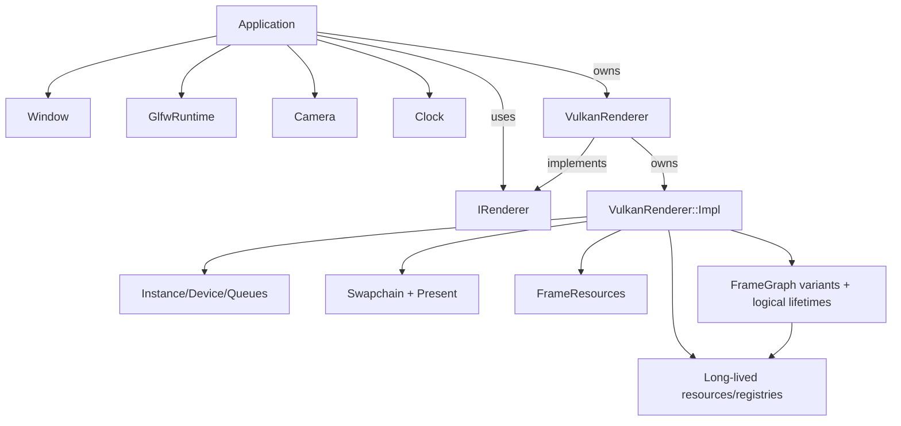

# Architecture

VolkEngine is currently a compact C++23 engine scaffold around a real Vulkan 1.3 renderer. The design bias is explicit ownership, measurable frame work, and a small public API until the engine has enough systems to justify broader abstraction.

## Subsystem map

| Path | Responsibility | Public surface |
| --- | --- | --- |
| `engine/core` | Application lifecycle, config, clock, camera, world/entity-component storage, math, logging, file reads, assertions. | `EngineConfig`, `RunOptions`, `Application`, `World`, `Camera`, `Clock`, helper functions. |
| `engine/platform` | GLFW process runtime, window, input, framebuffer resize state, Vulkan surface creation. | `GlfwRuntime`, `Window`. |
| `engine/renderer` | Renderer contracts, lighting/material ABI and bounded planning contracts, world-to-scene extraction, scene submission data, procedural/imported mesh helpers, image loading, executable frame graph, and resource accounting. | `IRenderer`, `RenderStats`, `RenderDeviceInfo`, `SceneRenderList`, lighting/environment records, `WorldSceneExtractor`, `FrameGraph`, `GpuResourceRegistry`, mesh/image helpers. |
| `engine/renderer/vulkan/VulkanRenderer.hpp` | Backend façade used by app code: constructor/lifecycle + renderer entry points. | `VulkanRenderer`, `draw`, `meshBounds`, `stats`, `deviceInfo`, `requestScreenshot`, `waitIdle`; deleted copy/move. |
| `engine/renderer/vulkan/VulkanRendererImpl.hpp` | Private `Impl` declaration for backend state, method contracts, and lightweight shared helpers; source-local heavy helpers stay in their owning `.cpp` files. | Internal only (not part of engine API). |
| `engine/renderer/vulkan` | Cohesive split implementation units for backend internals. | `VulkanRenderer.cpp` (thin forwarding wrapper), plus module-specific `.cpp` files. |
| `engine/renderer/vulkan/VulkanRenderer.cpp` | Thin forwarding wrapper over `VulkanRenderer::Impl`. | Delegates each public call to private implementation. |
| `engine/shaders` | GLSL source compiled to SPIR-V by CMake. | Runtime shader files copied beside the sandbox. |
| `samples/sandbox` | Demo app, CLI flags, smoke scenarios. | Executable entry point, not engine API. |

## Ownership model

- `Application` owns `GlfwRuntime`, `Window`, `Camera`, `Clock`, and a renderer implementation; declaration order keeps the runtime alive until after the window and renderer are destroyed.
- `World` owns generational entities and component pools. `WorldSystemScheduler` owns a compiled deterministic system order and one deferred command buffer; system callbacks and contexts remain caller-owned. Caller-owned standalone `WorldCommandBuffer` instances stage structural changes during queries and replay detached FIFO batches only at explicit safe boundaries. World renderable components (`WorldSceneTransform`, `WorldSceneParent`, `WorldSceneRenderable`) remain simulation-owned; `WorldSceneExtractor` owns reusable render-list, local-pose history, and hierarchy-resolution storage. The generic ECS owns no child lists or hierarchy lifecycle hooks.
- Typed `SimulationEventChannel` instances are scheduler-owned setup resources with fixed inline payload storage. Systems observe the previous successful step and publish the next FIFO batch; callback/overflow rollback and partial-command-playback promotion keep event lifetime aligned with the scheduler's actual mutation boundary.
- Scheduler-owned `SimulationTimerQueue` resources add delayed and recurring typed payloads on integer successful-step ticks. Schedule/cancel mutations share the same rollback/promotion boundary as event channels, while monotonic handles and fixed storage avoid wall-time drift, stale-handle aliasing, and steady-state allocation.
- `ScenePersistence` is a stateless one-shot boundary over the explicit scene component subset. VESN v2 canonicalizes records by persistent 128-bit `WorldSceneIdentity`, stores hierarchy references by stable ID, validates bounded UTF-8 labels and complete parent graphs, and reconstructs into a temporary `World`; v1 file-local ordinals migrate deterministically on load. It does not expose or serialize generic type-erased component pools.
- `GlfwRuntime` owns GLFW process initialization/termination. `Window` borrows the runtime and owns only its native window handle; one runtime is allowed per process and GLFW calls remain on the main thread.
- `InputTracker` converts platform callbacks and bounded gamepad polling into GLFW-free value snapshots. Caller-owned fixed-capacity `InputActionMap` instances translate those physical snapshots into semantic gameplay actions at fixed-step boundaries without allocating or mutating global input policy.
- `VulkanRenderer` owns runtime Vulkan behavior via private `Impl`, but keeps ownership boundaries explicit:
  - `VulkanRenderer.hpp` remains the backend API entry boundary.
  - `VulkanRenderer.cpp` remains a minimal forwarding wrapper.
  - Internal Vulkan resources (`VkInstance`, device/queues, descriptor state, swapchain state, uploads, etc.) stay private.
- Buffers/images use explicit structs containing Vulkan handles plus VMA allocations; VMA picks memory types and suballocates. The frame graph owns logical transient lifetimes, slots, and activation/retirement order while the Vulkan backend realizes the physical bindings transactionally.
- Swapchain-owned image views, graph-owned depth/HDR targets, and per-image present semaphores are recreated at one swapchain ownership boundary. The fixed shadow atlas and generated HDR environment are renderer-owned long-lived images. Imported swapchain/readback/environment resources never enter graph lifecycle callbacks.
- Per-frame uniform, instance, local-light, Forward+ tile-header/index, shadow-view, and optional indirect buffers are frame-slot resources; the renderer grows bounded scene/light-list storage only after that frame's fence signals.

## Renderer split summary

The authoritative Vulkan file-role map lives in [Renderer pipeline](renderer-pipeline.md#source-map--ownership-current-source-split). Architecture depends on these boundaries:

- `VulkanRenderer.hpp` is the backend-facing public seam.
- `VulkanRenderer.cpp` forwards that seam to `VulkanRenderer::Impl`.
- `VulkanRendererImpl.hpp` owns private state declarations, helper structs, constants, and method declarations.
- Split `.cpp` units group lifecycle/device/swapchain/frame resources, long-lived textures/environment/shadow resources, meshes, pipelines, uploads, sync, visibility planning, Forward+/shadow preparation, frame orchestration, optional ImGui, and screenshot behavior behind the same private `Impl`. Backend-neutral light validation, reference tile assignment, and deterministic atlas assignment remain in `engine/renderer/Lighting.cpp`.
- `VmaUsage.cpp` remains the single translation unit defining VMA implementation usage.

## Runtime data flow

1. `Clock::tick()` samples wall elapsed/delta time; `Window::pollInput()` consumes one event-driven frame snapshot.
2. `Window::updateCamera()` applies that snapshot at render rate with a bounded wall delta.
3. `FixedStepClock` converts wall time into zero or more constant gameplay substeps with bounded retained debt. For scheduler-backed worlds, `WorldSceneExtractor` prepares TRS history, compiled systems execute single-threaded in dependency order, the scheduler plays structural commands once, and the extractor captures the successful state. Pending input edges/motion reach only the first emitted step while held state persists; failures discard scheduler commands, invalidate presentation history, and propagate.
4. The world run path builds a presentation snapshot with retained-debt alpha. It interpolates each entity's local translation/scale and shortest-path quaternion rotation one completed fixed step behind simulation, then iteratively resolves parent matrices before submission. New/recycled/teleported entities reset their local history; dead or stale parents detach and cyclic dependents are omitted. Both run paths then call `IRenderer::draw(camera, scene, sceneBuildMs, elapsedSeconds, frameDeltaMs)` immediately; the renderer borrows the reusable list synchronously.
5. `Visibility.cpp` computes visibility and work planning for LOD/grid batching and canonical material-class counts. `Lighting.cpp` validates the scene's directional/environment/local/probe records; the Vulkan lighting owner prepares bounded tile/atlas buffers and shadow cameras, then frame code fills mapped instance records.
6. `Frame.cpp` executes the selected compiled graph. Graph callbacks emit synchronization barriers and record Forward+ assignment, visibility cull, shadow atlas, optional depth, HDR PBR/environment shading, depth-pyramid, tonemap/ImGui, and optional screenshot work; one graphics submission/presentation remains the outer frame ownership boundary.
7. `RenderStats` and `RenderDeviceInfo` expose the actual GPU path, bounded pressure, feature capabilities, material coverage, and last completed timing state.

Scene files are loaded before entering `Application::run` and saved after it returns. Persistence therefore performs no frame-loop work and never competes with scheduler queries, deferred structural playback, extraction, or renderer borrowing.

## Public/private line

Engine contracts (`IRenderer`, `FrameGraph`, `RenderStats`, config data) live in engine headers.  
`engine/renderer/vulkan/VulkanRenderer.hpp` remains the only backend entrypoint for app wiring.  
Its private `Impl` keeps Vulkan internals isolated from application code, which allows:
- no Vulkan handle leakage beyond the renderer boundary,
- stable renderer construction/call shape during backend refactors,
- optional features (`ImGui`, screenshot behavior, pipeline hot reload) without contract churn.

## Current architectural constraints

- One renderer backend exists: Vulkan.
- The renderer interface is intentionally small: `draw`, `stats`, and `deviceInfo` (plus explicit screenshot/idle hooks).
- The frame graph executes passes and owns backend-neutral barrier, lifetime, and transient-slot contracts. Vulkan resource realization and command emission remain private backend responsibilities.
- World-to-scene extraction is explicit and CPU-side; it is an ECS bridge, not yet a general streaming scene system.
- Descriptor indexing enables a capability-gated bindless sampled-image table with stable texture indices; the Vulkan baseline retains a fixed descriptor fallback for unsupported devices.
