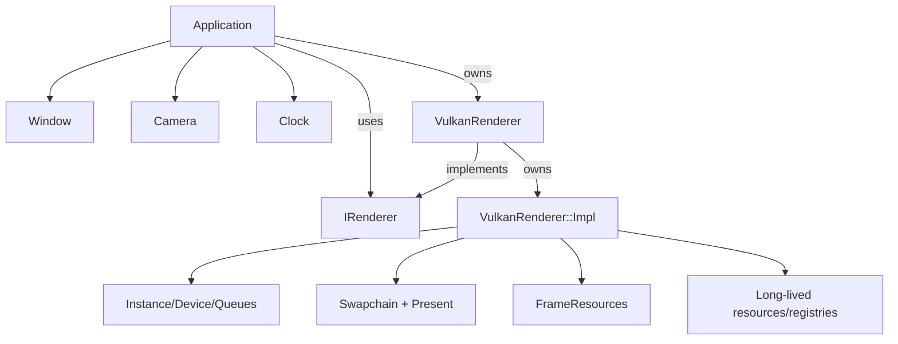

# Architecture

VolkEngine is currently a compact C++23 engine scaffold around a real Vulkan 1.3 renderer. The design bias is explicit ownership, measurable frame work, and a small public API until the engine has enough systems to justify broader abstraction.

## Subsystem map

| Path | Responsibility | Public surface |
| --- | --- | --- |
| `engine/core` | Application lifecycle, config, clock, camera, math, logging, file reads, assertions. | `EngineConfig`, `RunOptions`, `Application`, `Camera`, `Clock`, helper functions. |
| `engine/platform` | GLFW window, input, framebuffer resize state, Vulkan surface creation. | `Window`. |
| `engine/renderer` | Renderer contracts, scene submission data, generated geometry, image loading, frame graph metadata, resource accounting. | `IRenderer`, `RenderStats`, `RenderDeviceInfo`, `SceneRenderList`, `FrameGraph`, `GpuResourceRegistry`, mesh/image helpers. |
| `engine/renderer/vulkan/VulkanRenderer.hpp` | Backend façade used by app code: constructor/lifecycle + renderer entry points. | `VulkanRenderer`, `draw`, `stats`, `deviceInfo`, `requestScreenshot`, `waitIdle`; deleted copy/move. |
| `engine/renderer/vulkan/VulkanRendererImpl.hpp` | Private `Impl` declaration for all non-public renderer internals: state structs, helper utilities, private methods, members. | Internal only (not part of engine API). |
| `engine/renderer/vulkan` | Cohesive split implementation units for backend internals. | `VulkanRenderer.cpp` (thin forwarding wrapper), plus module-specific `.cpp` files. |
| `engine/renderer/vulkan/VulkanRenderer.cpp` | Thin forwarding wrapper over `VulkanRenderer::Impl`. | Delegates each public call to private implementation. |
| `engine/shaders` | GLSL source compiled to SPIR-V by CMake. | Runtime shader files copied beside the sandbox. |
| `samples/sandbox` | Demo app, CLI flags, smoke scenarios. | Executable entry point, not engine API. |

## Ownership model

- `Application` owns `Window`, `Camera`, `Clock`, and a renderer implementation.
- `Window` owns the GLFW handle and exposes events, size, title, camera input, and surface creation.
- `VulkanRenderer` owns runtime Vulkan behavior via private `Impl`, but keeps ownership boundaries explicit:
  - `VulkanRenderer.hpp` remains the backend API entry boundary.
  - `VulkanRenderer.cpp` remains a minimal forwarding wrapper.
  - Internal Vulkan resources (`VkInstance`, device/queues, descriptor state, swapchain state, uploads, etc.) stay private.
- Buffers/images use explicit structs containing Vulkan handles plus VMA allocations; VMA picks memory types and suballocates.
- Swapchain-owned image views, render targets, and per-image present semaphores are recreated with swapchain recreation.
- Per-frame uniform, instance, and indirect buffers are frame-slot resources; the renderer grows instance storage only after that frame's fence signals.

## Renderer split summary

The authoritative Vulkan file-role map lives in [Renderer pipeline](renderer-pipeline.md#source-map--ownership-current-source-split). Architecture depends on these boundaries:

- `VulkanRenderer.hpp` is the backend-facing public seam.
- `VulkanRenderer.cpp` forwards that seam to `VulkanRenderer::Impl`.
- `VulkanRendererImpl.hpp` owns private state declarations, helper structs, constants, and method declarations.
- Split `.cpp` units group lifecycle/device/swapchain/frame resources, long-lived resources, meshes, pipelines, uploads, sync, visibility planning, frame orchestration, optional ImGui, and screenshot behavior behind the same private `Impl`.
- `VmaUsage.cpp` remains the single translation unit defining VMA implementation usage.

## Runtime data flow

1. `Clock::tick()` returns elapsed and delta time.
2. `Window::updateCamera()` applies keyboard/mouse input to `Camera`.
3. `Application::run()` calls `IRenderer::draw(camera, elapsedSeconds, frameDeltaMs)`.
4. `Frame.cpp` calls `DemoSceneRenderer::build(...)` to create `SceneRenderList`.
5. `Frame.cpp` computes visibility and work planning (`planSceneVisibility`) for LOD/grid batching, then fills mapped frame instance buffers.
6. `Frame.cpp` records command buffers, submits/presents the frame, and only executes the screenshot copy/write path when a request is pending.
7. `RenderStats` and `RenderDeviceInfo` expose what path was used and how the last submitted frame behaved.

## Public/private line

Engine contracts (`IRenderer`, `FrameGraph`, `RenderStats`, config data) live in engine headers.  
`engine/renderer/vulkan/VulkanRenderer.hpp` remains the only backend entrypoint for app wiring.  
Its private `Impl` keeps Vulkan internals isolated from application code, which allows:
- no Vulkan handle leakage beyond the renderer boundary,
- stable renderer construction/call shape during backend refactors,
- optional features (`ImGui`, screenshot behavior, pipeline hot reload) without contract churn.

## Current architectural constraints

- One renderer backend exists: Vulkan.
- The renderer interface is intentionally small: `draw`, `stats`, and `deviceInfo` (plus explicit screenshot/idle hooks).
- The frame graph is metadata/validation, not yet a transient-resource allocator or barrier owner.
- Scene submission is data-oriented and demo-focused; it is not a general ECS or streaming scene system yet.
- Descriptor indexing support is reported as capability metadata, but bindless descriptors are not enabled until the resource model needs them.
