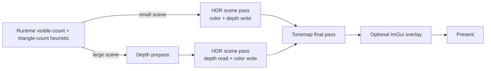

# Renderer pipeline

This page describes backend runtime behavior and the current Vulkan implementation split.
Public type contracts remain in [Renderer API](../api/renderer.md), [Scene API](../api/scene.md), and [Frame graph API](../api/frame-graph.md).

For engine-facing code, prefer `IRenderer`; direct `VulkanRenderer` usage is backend integration and not required for normal app/game rendering flow.

## Source-map / ownership (current source split)

- `engine/renderer/vulkan/VulkanRenderer.hpp` — backend-specific public facade exposing `VulkanRenderer(Window&, EngineConfig)`, deleted copy/move, and methods:
  `draw`, `stats`, `deviceInfo`, `requestScreenshot`, `waitIdle`.
- `engine/renderer/vulkan/VulkanRenderer.cpp` — thin public wrapper that forwards every call to `VulkanRenderer::Impl`.
- `engine/renderer/vulkan/VulkanRendererImpl.hpp` — private implementation state and detail helpers (`Impl`, shared structs, constants, utility helpers, frame-graph and frame data declarations).
- `engine/renderer/vulkan/VulkanRenderer.Lifecycle.cpp` — startup/shutdown orchestration, constructor error rollback, `cleanupResources`, and swapchain-dependent setup/teardown entry points.
- `engine/renderer/vulkan/VulkanRenderer.Device.cpp` — Vulkan instance and debug-utils setup, surface creation, physical/logical-device setup, queue-family selection, queue creation, allocator creation, command pool bootstrap, and debug-object-name/debug-label helper functions.
- `engine/renderer/vulkan/VulkanRenderer.Swapchain.cpp` — swapchain capability queries, format/present-mode/extents choice, swapchain/image-view creation, and swapchain resize/recreate lifecycle for depth/HDR attachments.
- `engine/renderer/vulkan/VulkanRenderer.FrameResources.cpp` — per-frame resources, fences/semaphores, timestamp queries, and executable frame-graph variant construction/diagnostics.
- `engine/renderer/vulkan/VulkanRenderer.Resources.cpp` — long-lived GPU buffers/images, texture loading/sampling state, descriptor layouts/pools/sets, tonemap descriptor setup, and resource-registry metadata.
- `engine/renderer/vulkan/VulkanRenderer.Meshes.cpp` — procedural mesh construction, imported OBJ mesh loading, geometry buffer uploads, mesh-batch arrays, and `GpuMesh` offset/count helpers.
- `engine/renderer/vulkan/VulkanRenderer.Pipelines.cpp` — shader modules, pipeline layouts/pipelines, pipeline cache load/save/validation, and hot-reload path.
- `engine/renderer/vulkan/VulkanRenderer.Sync.cpp` — graph-usage to Vulkan synchronization mapping, tracked transitions, and rollback snapshots.
- `engine/renderer/vulkan/VulkanRenderer.Uploads.cpp` — staging uploads and transfer-queue versus same-queue synchronization.
- `engine/renderer/vulkan/VulkanRenderer.Visibility.cpp` — frustum extraction/culling, grid visibility acceleration, LOD bucketing, and draw-work planning.
- `engine/renderer/vulkan/VulkanRenderer.Frame.cpp` — draw orchestration, graph execution callbacks, dynamic-rendering pass recording, submission/presentation, stats, and screenshot integration.
- `engine/renderer/vulkan/VulkanRenderer.ImGui.cpp` — optional diagnostics overlay (`VOLKENGINE_ENABLE_IMGUI`) lifecycle and rendering.
- `engine/renderer/vulkan/VulkanRenderer.Screenshot.cpp` — screenshot request/readback handling, swapchain readback copy, PPM publishing, and temp/backup file behavior.
- `engine/renderer/vulkan/VmaUsage.cpp` — single translation unit containing `#define VMA_IMPLEMENTATION`.

`VulkanRenderer` startup is split across files but still follows this runtime sequence:

1. Create the instance and optional debug messenger.
2. Create the GLFW-backed surface, enumerate/rank physical devices, and select the adapter.
3. Create the logical device, queues, VMA allocator, debug-utils function pointers, and command pools.
4. Create the swapchain and image views, compile the cached frame-graph variants, then transactionally realize their depth/HDR resources.
5. Create textures/samplers/descriptors, pipeline cache/pipelines, frame resources, generated meshes, tonemap descriptors, and timestamp queries.
6. Create optional ImGui state, then log selected device capabilities and tracked resource totals.

`VulkanRenderer` enforces the contract: Vulkan 1.3, graphics/present/transfer queues, `VK_KHR_swapchain`, usable surface formats/present modes, dynamic rendering, and synchronization2.
Startup logs include rejected adapters and concrete rejection reasons.

## Frame loop

Each frame executes the same high-level sequence:

1. Wait for the current frame fence and retire frame-owned/deferred resources.
2. Read the previous frame timestamp bucket when GPU timestamps are enabled.
3. Compute camera matrices and the CPU visibility plan, grow mapped instance storage if required, update uniforms, and reset the frame command pool.
4. Acquire a swapchain image.
5. Consume any pending screenshot request and begin optional ImGui work.
6. Select and execute the compiled graph variant into one primary command buffer.
7. Submit once to the graphics queue with the expected wait stages.
8. Present using the acquired image’s per-image wait semaphore and, when required, rebuild swapchain state.

Preparation that can be completed independently of a swapchain image runs before acquisition. If recording, allocation, ImGui preparation, or pre-submit bookkeeping fails after acquisition, the renderer restores tracked image state, releases the acquired image by recreating the swapchain, replaces the now-signaled per-frame acquire semaphore, and rethrows. A failed screenshot request is requeued unless a newer request has superseded it. This prevents reuse of a signaled binary semaphore and prevents an acquired image from being stranded.

Normal rendering does not call `vkDeviceWaitIdle`; the device-idle recovery path is reserved for swapchain recreation and exceptional post-acquire rollback.

## Render passes

Default adaptive path (`--auto-depth-prepass`, also `EngineConfig` default):

Forced no-prepass (`--no-depth-prepass`) selects a graph containing HDR depth-write, tonemap, and optional screenshot passes. Forced prepass (`--depth-prepass`) selects a graph containing the depth-only pass, HDR depth-read pass, tonemap, and optional screenshot pass.

`Auto` caches all depth/no-depth and screenshot/no-screenshot combinations and selects one after visibility planning; forced modes cache only their valid depth state. `FrameGraph::execute` owns pass order, logical resource activation/retirement, and barrier intent dispatch. Vulkan callbacks own physical resource bindings and command emission.
Depth uses reverse-Z: `Math.hpp::perspective` maps near to 1 and far to 0, depth attachments clear to 0, and Vulkan depth tests use `GREATER`/`GREATER_OR_EQUAL`.

The renderer uses Vulkan dynamic rendering (`vkCmdBeginRendering` / `vkCmdEndRendering`) rather than render-pass/framebuffer objects.
Swapchain images are preferred as UNORM because `tonemap.frag` normally applies exposure, ACES, and the standard sRGB OETF manually; if a surface only provides an sRGB swapchain format, the tonemap push constant disables shader-side OETF so Vulkan performs the single required encode.

## Scene submission

- Generated and imported CPU meshes are triangle lists that keep full-float position/normal/uv/tangent data for import and tangent generation, then write compact Vulkan `GpuVertex` records directly into one mapped staging buffer: full-float position/UV plus SNORM16 normal/tangent attributes. All batches share one vertex buffer and one index buffer; indices are reordered for post-transform vertex-cache locality, then vertices are remapped to first-use order for vertex-fetch locality while `loadObjMesh()` keeps source OBJ fan order until upload.
- `GpuMesh` records carry offset/count values only.
- `SceneRenderItem` records carry mesh ID, model matrix, material constants, and bounds. The GPU path uploads compact cull candidates and instance records; the direct fallback retains CPU materialization.
- Capability-gated bindless scene descriptors use stable texture-table indices for albedo, normal, and ORM roles. Devices without the required descriptor-indexing features retain fixed material descriptor sets.
- Meshes are cooked into bounded clusters with bounds and per-mesh ranges. A compute pass performs instance/cluster frustum tests, sphere LOD selection, temporal depth-pyramid occlusion, visible-instance compaction, and indirect-command generation.
- The temporal Hi-Z pass reads the previous completed pyramid during culling, renders the current depth/HDR work, then conservatively reduces current reverse-Z depth into a half-resolution R32 pyramid for the next submission. Proportional footprints retain odd-extent edge texels.
- The frame graph declares cull buffers and the depth pyramid explicitly; same-queue submission order and graph barriers carry the temporal image from the current build to the next frame's read.
- `vkCmdDrawIndexedIndirect` submits the generated cluster commands when `multiDrawIndirect`, `drawIndirectFirstInstance`, and `maxDrawIndirectCount` allow it. `--no-indirect-draws` selects the direct indexed fallback.

## Swapchain and resize

- `--vsync` selects FIFO.
- `--no-vsync` prefers immediate, then mailbox, then FIFO.
- Resize/minimize waits for a non-zero framebuffer extent and returns if the window closes while minimized.
- Swapchain recreation rebuilds image views, per-image render-finished semaphores, depth/HDR images, and tonemap/ImGui state.
- Pipelines are recreated when dependent formats change; otherwise existing pipelines are reused. Recreate/teardown paths detach active pipeline handles into a `PipelineSet` before destruction so member handles are nulled before any cleanup or error path can observe them.

## Screenshot path

`VulkanRenderer::requestScreenshot(path)` queues one screenshot request with latest-request-wins coalescing while a request is still pending.
The next `draw()` consumes it, records an image-to-buffer transfer copy from the final swapchain image when supported, and waits on the submitting frame before writing disk. A failure before queue submission returns the consumed path to the pending slot unless a newer request has already replaced it.
Output is complete-before-publish:

- writes binary PPM (P6) via a temporary file,
- renames into place atomically when possible,
- falls back to backup/restore if target replacement is restricted by platform semantics.

Unsupported format/usage combinations (no `TRANSFER_SRC` support or non-UNORM swapchain format) are reported and skipped safely.

## Debug and diagnostics

- Debug-utils names are assigned to long-lived Vulkan objects when available.
- Pass regions are labeled for RenderDoc/validation captures.
- `RenderStats` exposes CPU timing buckets, optional GPU timing validity, draw counts, scene/submitted triangle counts, visibility and grid telemetry, LOD counts, instance capacity, and submission mode.
- `RenderDeviceInfo` mirrors adapter, feature, and upload-sync decisions.
- ImGui is optional; `--no-imgui` skips overlay initialization and overlay work.
