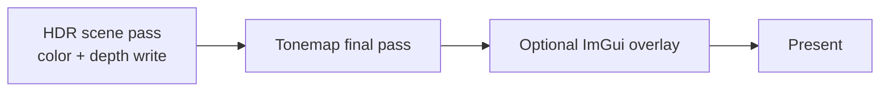
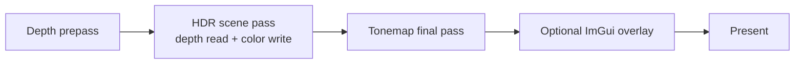

# Renderer pipeline

This page describes backend runtime behavior and the current Vulkan implementation split.
Public type contracts remain in [Renderer API](../api/renderer.md), [Scene API](../api/scene.md), and [Frame graph API](../api/frame-graph.md).

For engine-facing code, prefer `IRenderer`; direct `VulkanRenderer` usage is backend integration and not required for normal app/game rendering flow.

## Source-map / ownership (current source split)

- `engine/renderer/vulkan/VulkanRenderer.hpp` — backend-specific public facade exposing `VulkanRenderer(Window&, EngineConfig)`, deleted copy/move, and methods:
  `draw`, `stats`, `deviceInfo`, `requestScreenshot`, `waitIdle`.
- `engine/renderer/vulkan/VulkanRenderer.cpp` — thin public wrapper that forwards every call to `VulkanRenderer::Impl`.
- `engine/renderer/vulkan/VulkanRendererImpl.hpp` — private implementation state and detail helpers (`Impl`, shared structs, constants, utility helpers, frame-graph and frame data declarations).
- `engine/renderer/vulkan/VulkanRenderer.Lifecycle.cpp` — startup/shutdown orchestration, constructor error rollback, `cleanupResources`, and swapchain-dependent setup/teardown entry points.
- `engine/renderer/vulkan/VulkanRenderer.Device.cpp` — Vulkan instance and debug-utils setup, surface creation, physical/logical-device setup, queue-family selection, queue creation, allocator creation, command pool bootstrap, and debug-object-name/debug-label helper functions.
- `engine/renderer/vulkan/VulkanRenderer.Swapchain.cpp` — swapchain capability queries, format/present-mode/extents choice, swapchain/image-view creation, and swapchain resize/recreate lifecycle for depth/HDR attachments.
- `engine/renderer/vulkan/VulkanRenderer.FrameResources.cpp` — per-frame resources (uniform and instance buffers, descriptor sets), mapped per-frame state, per-frame fences/semaphores, timestamp queries, and frame-graph construction metadata.
- `engine/renderer/vulkan/VulkanRenderer.Resources.cpp` — long-lived GPU buffers/images, texture loading/sampling state, descriptor layouts/pools/sets, tonemap descriptor setup, and resource-registry metadata.
- `engine/renderer/vulkan/VulkanRenderer.Meshes.cpp` — generated geometry construction, geometry buffer uploads, and `GpuMesh` offset/count helpers.
- `engine/renderer/vulkan/VulkanRenderer.Pipelines.cpp` — shader modules, pipeline layouts/pipelines, pipeline cache load/save/validation, and hot-reload path.
- `engine/renderer/vulkan/VulkanRenderer.Sync.cpp` — image layout/access state helpers, image transition barriers, and sync-state bookkeeping for frame-graph usage.
- `engine/renderer/vulkan/VulkanRenderer.Uploads.cpp` — staging uploads and transfer-queue vs same-queue synchronization (including one-shot upload fences/semaphores).
- `engine/renderer/vulkan/VulkanRenderer.Visibility.cpp` — frustum extraction/culling, grid visibility acceleration, LOD bucketing, and draw-work planning.
- `engine/renderer/vulkan/VulkanRenderer.Frame.cpp` — draw loop, command recording/submission/presentation, stats, pacing, and screenshot path integration.
- `engine/renderer/vulkan/VulkanRenderer.ImGui.cpp` — optional diagnostics overlay (`VOLKENGINE_ENABLE_IMGUI`) lifecycle and rendering.
- `engine/renderer/vulkan/VulkanRenderer.Screenshot.cpp` — screenshot request/readback handling, swapchain readback copy, PPM publishing, and temp/backup file behavior.
- `engine/renderer/vulkan/VmaUsage.cpp` — single translation unit containing `#define VMA_IMPLEMENTATION`.

`VulkanRenderer` startup is split across files but still follows this runtime sequence:

1. Create the instance and optional debug messenger.
2. Create the GLFW-backed surface, enumerate/rank physical devices, and select the adapter.
3. Create the logical device, queues, VMA allocator, debug-utils function pointers, and command pools.
4. Create the swapchain, image views, depth image, and HDR image.
5. Create texture/sampler/descriptors, pipeline cache, pipelines, frame resources, generated meshes, tonemap descriptors, timestamp queries, and the startup frame graph.
6. Create optional ImGui state, then log selected device capabilities and tracked resource totals.

`VulkanRenderer` enforces the contract: Vulkan 1.3, graphics/present/transfer queues, `VK_KHR_swapchain`, usable surface formats/present modes, dynamic rendering, and synchronization2.
Startup logs include rejected adapters and concrete rejection reasons.

## Frame loop

Each frame executes the same high-level sequence:

1. Wait for the current frame fence.
2. Read the previous frame timestamp bucket when GPU timestamps are enabled.
3. Acquire a swapchain image.
4. Build/reuse the demo `SceneRenderList`.
5. Compute camera matrices and build the CPU visibility plan.
6. Grow mapped per-frame instance storage if required, then update mapped scene uniforms.
7. Reset the current frame command pool.
8. Begin optional ImGui frame work when the overlay is enabled.
9. Record one primary command buffer.
10. Submit once to the graphics queue with the expected wait stages.
11. Present using the acquired image’s wait semaphore and, when required, rebuild swapchain state.

Normal rendering does not call `vkDeviceWaitIdle`.

## Render passes

Default path (`--no-depth-prepass`):

Depth-prepass path (`--depth-prepass`):

The renderer uses Vulkan dynamic rendering (`vkCmdBeginRendering` / `vkCmdEndRendering`) rather than render-pass/framebuffer objects.
Swapchain images are preferred as UNORM for tone-map output to avoid automatic sRGB re-encoding.

## Scene submission

- Generated meshes are packed into one shared vertex buffer and one shared index buffer.
- `GpuMesh` records carry offset/count values only.
- `SceneRenderItem` records carry mesh ID, model matrix, material constants, and bounds.
- Visibility planning extracts frustum planes from the camera view-projection matrix, culls bounding spheres, applies optional material-grid acceleration, and counts visible mesh work.
- Command recording writes visible instances into mesh-contiguous ranges of the mapped per-frame storage buffer.
- If `multiDrawIndirect`, `drawIndirectFirstInstance`, and `maxDrawIndirectCount` allow it, one `vkCmdDrawIndexedIndirect` submits all visible mesh batches per pass.
- Otherwise the renderer records direct `vkCmdDrawIndexed` per visible mesh batch.

## Swapchain and resize

- `--vsync` selects FIFO.
- `--no-vsync` prefers immediate, then mailbox, then FIFO.
- Resize/minimize waits for a non-zero framebuffer extent and returns if the window closes while minimized.
- Swapchain recreation rebuilds image views, per-image render-finished semaphores, depth/HDR images, and tonemap/ImGui state.
- Pipelines are recreated when dependent formats change; otherwise existing pipelines are reused.

## Screenshot path

`VulkanRenderer::requestScreenshot(path)` queues one screenshot request.
The next `draw()` consumes it, records an image-to-buffer transfer copy from the final swapchain image when supported, and waits on the submitting frame before writing disk.

Output is complete-before-publish:

- writes binary PPM (P6) via a temporary file,
- renames into place atomically when possible,
- falls back to backup/restore if target replacement is restricted by platform semantics.

Unsupported format/usage combinations (no `TRANSFER_SRC` support or non-UNORM swapchain format) are reported and skipped safely.

## Debug and diagnostics

- Debug-utils names are assigned to long-lived Vulkan objects when available.
- Pass regions are labeled for RenderDoc/validation captures.
- `RenderStats` exposes CPU timing buckets, optional GPU timing validity, draw/triangle counts, visibility and grid telemetry, LOD counts, instance capacity, and submission mode.
- `RenderDeviceInfo` mirrors adapter, feature, and upload-sync decisions.
- ImGui is optional; `--no-imgui` skips overlay initialization and overlay work.
