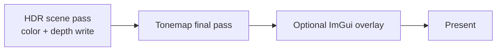
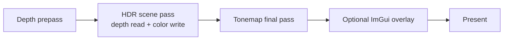

# Renderer pipeline

This page describes backend behavior. Public type contracts live in [Renderer API](../api/renderer.md), [Scene API](../api/scene.md), and [Frame graph API](../api/frame-graph.md).

## Backend startup

`VulkanRenderer` initializes:

1. Vulkan instance and optional debug messenger.
2. GLFW surface from `Window`.
3. Physical-device suitability report and ranked adapter selection.
4. Logical device and graphics/present/transfer queues.
5. Command pools, swapchain, depth target, HDR target, descriptors, pipelines, frame resources, generated meshes, optional timestamp queries, and optional Dear ImGui backend.

A device must satisfy the renderer contract: Vulkan 1.3, graphics/present/transfer queues, `VK_KHR_swapchain`, usable surface format/present mode, dynamic rendering, and synchronization2. Startup errors list rejected adapters and concrete reasons.

## Frame loop

Each frame executes the same high-level sequence:

1. Wait for the current frame fence.
2. Read the previous timestamp range for that frame slot when timestamps are enabled.
3. Acquire a swapchain image.
4. Update mapped scene uniforms.
5. Build the CPU visibility plan from `SceneRenderList`.
6. Ensure the current frame's mapped instance storage can hold the visible compacted count.
7. Build ImGui draw data when the overlay is enabled.
8. Reset the frame command pool and record one primary command buffer.
9. Submit once to the graphics queue.
10. Present using the acquired image's present-wait semaphore.

Normal rendering does not call `vkDeviceWaitIdle`.

## Render passes

Default path (`--no-depth-prepass`):

Depth-prepass path (`--depth-prepass`):

The renderer uses Vulkan dynamic rendering, not render-pass/framebuffer objects. The swapchain format is UNORM with manual gamma in the tonemap shader to avoid sRGB double encoding.

## Scene submission

- Generated meshes are packed into one shared vertex buffer and one shared index buffer.
- `GpuMesh` records contain offsets and counts only.
- `SceneRenderItem` records carry mesh ID, model matrix, material constants, and bounding sphere.
- Visibility planning extracts frustum planes from the camera view-projection matrix, culls bounding spheres, applies optional material-grid tile acceleration, and counts visible work by mesh bucket.
- Command recording writes visible instances into mesh-contiguous ranges of the mapped per-frame storage buffer.
- If `multiDrawIndirect`, `drawIndirectFirstInstance`, and `maxDrawIndirectCount` allow it, one `vkCmdDrawIndexedIndirect` submits all visible mesh batches per scene pass.
- Otherwise the renderer falls back to direct `vkCmdDrawIndexed` per visible mesh batch.

## Swapchain and resize

- `--vsync` selects FIFO.
- `--no-vsync` prefers immediate, then mailbox, then FIFO.
- Resize/minimize waits for a non-zero framebuffer extent and aborts if the window closes while minimized.
- Swapchain recreation rebuilds image views, present semaphores, depth/HDR images, the tonemap descriptor, and ImGui swapchain state.
- Graphics pipelines are reused when HDR, depth, and swapchain formats are unchanged.

## Screenshot path

`VulkanRenderer::requestScreenshot(path)` queues one screenshot request. The next `draw()` consumes it, records a copy from the final LDR swapchain image to a transient host-visible readback buffer, queues presentation first, waits for the submitted frame, maps the readback allocation, and writes binary PPM/P6 RGB.

Screenshot output is complete-before-publish: bytes are written to a sibling temp file, checked, then moved into place with a backup/restore fallback for platforms that cannot replace an existing file directly.

## Debug and diagnostics

- Debug-utils names are assigned to long-lived Vulkan objects when available.
- Pass regions are labeled for RenderDoc/validation captures.
- `RenderStats` exposes CPU timing buckets, GPU timing validity, draw/triangle counts, visibility counts, grid telemetry, LOD counts, instance capacity, and submission mode.
- `RenderDeviceInfo` mirrors adapter, feature, and upload-sync decisions.
- ImGui is optional; `--no-imgui` avoids overlay initialization and per-frame overlay work.
